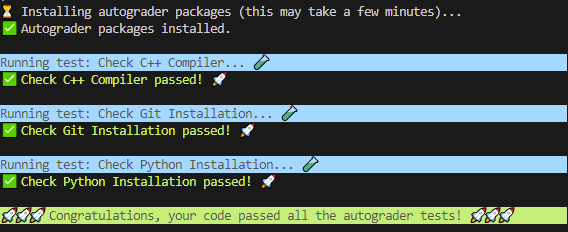

# 作业环境配置！

截止时间：4月17日（星期五）深夜 11:59

## 概述

欢迎来到 CS106L！本次作业将帮助你配置好本学期后续所需的环境，以便后续所有作业的配置过程都能简单顺畅。完成本次作业后，你将能够在 VSCode 中编译并运行 C++ 文件，以及运行自动评分器（autograder）——在接下来的每个作业中你都会用到它们！

如果在配置过程中遇到任何问题，请随时在 [EdStem](https://edstem.org/us/courses/81492/discussion) 上联系我们，或参加我们的答疑时间（office hours）！

## 第 1 部分：安装 Python

### 第 1.1 节：检查已有的 Python 安装

CS106L 每个作业的自动评分器都使用 Python。你必须安装 `3.8` 或更高版本的 Python。要检查你的 Python 版本，可以在终端中运行以下命令：

如果你使用的是 Linux 或 Mac：

```sh
python3 --version

```

如果你使用的是 Windows：

```sh
python --version

```

如果你得到的版本在 `3.8` 或更高，那就没问题了，**你可以直接继续进行第 2 部分**。否则，请按照第 1.2 节的步骤在你的电脑上安装 Python。

### 第 1.2 节：安装 Python（如果你尚未安装）

#### Mac 与 Windows

请在 [此处](https://www.python.org/downloads/) 下载最新的 Python 版本并运行安装程序。**注意：在 Windows 上，你必须在安装程序中勾选 `Add python.exe to PATH`（将 python.exe 添加到 PATH）**。安装完成后，请按照 **第 1.1 节** 的步骤验证安装是否成功。

#### Linux

以下说明适用于基于 Debian 的发行版（如 Ubuntu）。已在 Ubuntu 20.04 LTS 上测试。

1. 运行以下命令更新 Ubuntu 软件包列表：

```sh
sudo apt-get update

```

2. 安装 Python：

```sh
sudo apt-get install python3 python3-venv

```

3. 重启终端并运行以下命令验证安装是否成功：

```sh
python3 --version

```

## 第 2 部分：配置 VSCode 与 C++ 编译器

本课程将使用 VSCode 来编写 C++ 代码。以下是在你的电脑上配置 VSCode 以及 GCC 编译器的说明。

### Mac

#### 第一步：安装 VSCode

前往 [此链接](https://code.visualstudio.com/docs/setup/mac) 并下载适用于 Mac 的 Visual Studio Code。按照该网页中 **Installation**（安装）小节下的说明进行操作。

在 VSCode 内部，前往扩展（extensions）标签页，搜索 **C/C++**。点击 **C/C++** 扩展，然后点击 **Install**（安装）。

最后，打开命令面板（Cmd+Shift+P），搜索 `Shell Command: Install 'code' command in PATH` 并选择它。这将允许你直接通过在终端运行 `code` 命令来启动 VSCode。

**🥳 至此，你应该已经成功在 Mac 上安装了 VSCode 👏**

#### 第二步：安装 C++ 编译器

1. 运行以下命令检查是否已安装 Homebrew：

```sh
brew --version
```

如果你看到类似于下面的输出：

```sh
 brew --version
 Homebrew 4.2.21
```

那么可以跳到第 3 步。如果你看到其他任何看起来不太对劲的输出，请继续执行第 2 步！
2. 运行以下命令：

```sh
/bin/bash -c "$(curl -fsSL https://raw.githubusercontent.com/Homebrew/install/HEAD/install.sh)"
```

这将下载 Mac 的包管理器 Homebrew🍺。哇呼！
3. 运行以下命令：

```sh
brew install gcc
```

这将在你的电脑上安装 GCC 编译器。
4. 记下 Homebrew 安装的 GCC 版本。在大多数情况下是 `g++-14`。默认情况下，Mac 上的 `g++` 命令是内置 `clang` 编译器的别名。我们可以通过运行：

```sh
echo 'export PATH="$(brew --prefix)/bin:$PATH"\nalias g++="g++-14"' >> ~/.zshrc
```

来修复这个问题，使 `g++` 指向我们刚安装的 GCC 版本。请将上述命令中的 `g++-14` 修改为你实际安装的 GCC 版本。
5. 重启终端并运行以下命令验证一切是否工作正常：

```sh
g++ --version
```

> [!NOTE]
> 如果你使用 VSCode 来运行代码，在运行这最后一个命令时可能会遇到问题。**请确保你使用的是 VSCode 内置的 `zsh` 终端**，如下图所示：
> 
> 在本课程中，每当你需要运行 `g++` 时都需要这样做。**或者，你可以将 VSCode 的默认终端更改为 zsh**：按 Cmd+Shift+P，进入 **Terminal: Select Default Profile**（终端：选择默认配置文件），然后选择 **`zsh`**。

### Windows

#### 第一步：安装 VSCode

前往 [此链接](https://code.visualstudio.com/docs/setup/windows) 并下载适用于 Windows 的 Visual Studio Code。按照该网页中 **Installation**（安装）小节下的说明进行操作。

在 VSCode 内部，前往扩展（extensions）标签页，搜索 **C/C++**。点击 **C/C++** 扩展，然后点击 **Install**（安装）。

**🥳 至此，你应该已经成功在 PC 上安装了 VSCode 👏**

#### 第二步：安装 C++ 编译器

1. 按照 [此链接](https://code.visualstudio.com/docs/cpp/config-mingw) 中 **Installing the MinGW-w64 toolchain**（安装 MinGW-w64 工具链）小节下的说明进行操作。
2. 完整遵循 **Installing the MinGW-w64 toolchain** 下的说明后，你现在应该可以通过运行以下命令来验证一切正常：

```sh
g++ --version
```

### Linux

以下说明适用于基于 Debian 的发行版（如 Ubuntu）。已在 Ubuntu 20.04 LTS 上测试。

#### 第一步：安装 VSCode

前往 [此链接](https://code.visualstudio.com/docs/setup/linux) 并下载适用于 Linux 的 Visual Studio Code。按照该网页中 **Installation**（安装）小节下的说明进行操作。

在 VSCode 内部，前往扩展（extensions）标签页，搜索 **C/C++**。点击 **C/C++** 扩展，然后点击 **Install**（安装）。

最后，打开命令面板（Ctrl+Shift+P），搜索 `Shell Command: Install 'code' command in PATH` 并选择它。这将允许你直接通过在终端运行 `code` 命令来启动 VSCode。

**🥳 至此，你应该已经成功在 Linux 机器上安装了 VSCode 👏**

#### 第二步：安装 C++ 编译器

1. 在终端中，运行以下命令更新 Ubuntu 软件包列表：

```sh
sudo apt-get update
```

2. 接下来安装 `g++` 编译器：

```sh
sudo apt-get install g++-10
```

3. 默认情况下会使用系统自带的 `g++` 版本。要将其更改为你刚安装的版本，可以像下面这样配置 Linux 使用已安装的 G++ 10 或更高版本：

```sh
sudo update-alternatives --install /usr/bin/g++ g++ /usr/bin/g++-10 10
```

4. 重启终端并验证 GCC 是否已正确安装。你的 `g++` 版本必须为 10 或更高：

```sh
g++ --version
```

## 第 3 部分：通过 Git 克隆课程代码！

Git 是一种流行的版本控制系统（VCS），我们将用它来分发作业的初始代码（starter code）。运行以下命令确保你已安装 Git：

```sh
git --version
```

如果看到任何不太对劲的提示，请 [在此页面下载并安装 Git](https://git-scm.com/downloads)！

### 下载初始代码

打开 VSCode，然后打开终端（按 Ctrl+` 或点击窗口顶部的 **终端 > 新建终端**），并运行以下命令：

```sh
git clone https://github.com/cs106l/cs106l-assignments.git
```

这会将初始代码下载到名为 `cs106l-assignments` 的文件夹中。

### 打开 VSCode 工作区

在本课程中完成作业时，我们建议你针对正在进行的特定作业文件夹打开一个 VSCode 工作区（workspace）。因此，如果你现在有了 `cs106l-assignments` 文件夹，可以首先通过 `cd`（切换目录）命令进入正确的文件夹：

```sh
cd cs106l-assignments/assignment0
```

这会将你的工作目录切换到 `assignment0`，然后你可以打开专门针对此文件夹的 VSCode 工作区：

```sh
code .
```

现在你应该准备就绪了！

### 获取作业更新

当我们更新现有作业和发布新作业时，会将更新推送（push）到此仓库（repository）。要获取新作业，请在你的 `cs106l-assignments` 目录中打开终端并运行：

```sh
git pull origin main
```

现在你应该已经获得了最新的初始代码！

# 第 4 部分：测试你的配置！

现在我们将让你编译第一个 C++ 文件并运行自动评分器。要运行任何 C++ 代码，首先需要对其进行编译。打开 VSCode 终端（再次提醒，按 Ctrl+`或点击窗口顶部的 **终端 > 新建终端**）。然后确保你处于`assignment-setup/` 目录下，并运行：

```sh
g++ -std=c++23 main.cpp -o main
```

这会把 C++ 文件 `main.cpp` **编译**为一个名为 `main` 的可执行文件，其中包含处理器可以直接执行的原始机器码。假设你的代码编译成功且没有任何错误，现在你可以运行：

```sh
./main
```

这会实际执行 `main.cpp` 中的 `main` 函数。它会执行你的代码，随后启动自动评分器以检查你的配置是否正确。

> [!NOTE]
> ### Windows 注意事项
>
> 在 Windows 上，你可能需要使用以下命令编译代码才能看到输出：
>
> ```sh
> g++ -static-libstdc++ -std=c++20 main.cpp -o main
>
> ```
>
> 此外，输出的可执行文件可能被称为 `main.exe`，在这种情况下，你需要使用以下命令运行代码：
>
> ```sh
> ./main.exe
>
> ```

> [!NOTE]
> ### Mac 注意事项
>
> 尝试编译此代码时，如果提示缺少 `wchar.h`（或类似的某些文件），可能会遇到编译器错误。如果发生这种情况，你可能需要通过运行以下命令在你的电脑上重新安装 Xcode 命令行工具：
>
> ```sh
> sudo rm -rf /Library/Developer/CommandLineTools
> sudo xcode-select --install
>
> ```
>
> 之后，你应该就可以正常编译了。

# 🚀 完成之后……

编译并运行后，如果你的自动评分器显示如下：



那么你就完成了作业环境配置！哇呼！你现在可以继续前往 [作业 1](https://www.google.com/search?q=assignment1/README.md) 了！
