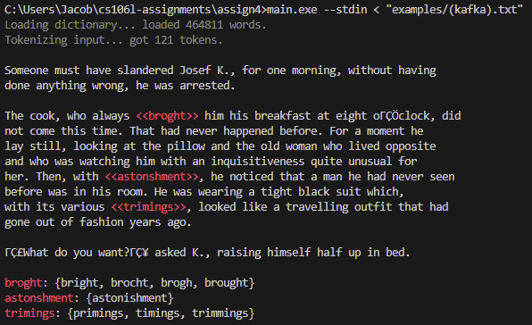
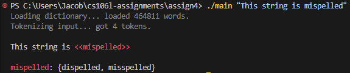

<p align="center">
  
</p>

# 作业 4：Ispell

**截止时间：5 月 8 日（星期五）晚上 11:59**

## 概述（Overview）

既然我们已经花了一些时间探讨了 C++ 标准模板库（STL）的核心组件——容器、迭代器、函数对象（functors）和算法——以及驱动它们背后的关键要素：模板，现在就让我们把这些知识融会贯通吧！
在本次作业中，你将为 [Ispell](https://en.wikipedia.org/wiki/Ispell) 编写核心逻辑。Ispell 是一个经典的 Unix 风格拼写检查器，用于执行基础的拼写检查。为此，你将编写一些代码，充分利用 `<algorithm>` 头文件以及全新的 C++ Ranges（范围）库。

你的所有代码都将写在 `spellcheck.cpp` 中。完成之后，你将得到一个如下所示的拼写检查器：

<p align="center">
  
</p>

> [!IMPORTANT]
> 这份作业说明看起来可能有点长，但实际上你需要编写的代码量**并不多**！为了让大家（希望能够）更顺畅地完成作业，我们包含了很多额外的细节。如果有任何让你困惑的地方，请随时联系我们（在 Ed 论坛、课堂或 Office Hours 提问均可）！我们也会在周二（5/05）的课堂上讲解 `tokenize`，以帮助大家顺利开展本次作业！

要下载本次作业的初始代码（Starter code），请参阅课程作业仓库中的 **[入门指南（Getting Started）](https://www.google.com/search?q=../README.md%23getting-started)** 规范。

## 运行你的代码（Running your code）

要运行你的代码，首先需要对其进行编译。打开终端（如果你使用的是 VSCode，请按 Ctrl+`或点击顶部的 **终端 > 新建终端**）。然后确保你处于`assignment4/` 目录下，并运行：

```sh
g++ -std=c++20 main.cpp spellcheck.cpp -o main
```

假设你的代码编译成功且没有任何编译器错误，现在你可以运行：

```sh
./main
```

这将会实际执行 `main.cpp` 中的 `main` 函数。

在你按照下面的说明操作时，我们建议你间歇性地使用自动评分器（Autograder）进行编译/测试，以此来确保你的开发路线是正确的！

> [!NOTE]
> ### Windows 用户注意事项
>
> 在 Windows 系统上，你可能需要使用以下命令来编译代码，才能正常看到输出：
>
> ```sh
> g++ -static-libstdc++ -std=c++20 main.cpp spellcheck.cpp -o main
> ```
>
> 此外，生成的输出可执行文件可能叫 `main.exe`，这种情况下你需要使用以下命令运行：
>
> ```sh
> ./main.exe
> ```

## 构建 Ispell（Building Ispell）

经典的 Unix 程序 Ispell 工作原理如下：首先，将包含所有常用英语单词的词典加载到内存中。如果一个单词在词典中找不到，它就会被标记为拼写错误。每个拼写错误单词的建议替换项是通过 [Damerau-Levenshtein 距离（编辑距离）](https://en.wikipedia.org/wiki/Damerau%E2%80%93Levenshtein_distance) 算法找出的。该算法可以计算出将一个单词转换为另一个单词大致需要多少次编辑操作（添加、删除或替换单个字母，或者交换两个相邻字母）。如果某个拼写错误的单词与词典中的某个单词之间的 Damerau-Levenshtein 距离**恰好为 1**，那么该词典单词就会被添加到建议替换列表中。这里的核心思想是：当人们拼错一个单词时，通常只是差了一处微小的修改（例如“mispelled”与“misspelled”）。

在本次作业中，我们已经为你搭建好了构建该拼写检查器的所有基础设施，包括 Damerau-Levenshtein 算法函数的实现。你的任务是实现拼写检查单词的核心算法。具体来说，你将实现一个将输入字符串拆分为标记集合（Token set）的算法（`tokenize`），以及另一个根据拆分好的标记输入字符串和词典来实际识别拼写错误单词的算法（`spellcheck`）。
为了增加一点挑战性（同时也为了与上周的课程内容相呼应），这里有一个限制约束：**你的代码中不能使用任何 `for` 或 `while` 循环**。你必须完全使用 STL 来实现这些任务：使用传统的 STL 算法实现 `tokenize`，使用全新的 Ranges 库实现 `spellcheck`。在此过程中，你将体验到如何利用算法和 Lambda 函数在现代 C++ 中操作数据结构。

这听起来可能有点多，但别担心！这份文档会详细带你走过每一个算法的实现步骤。

### `tokenize`（分词）

```cpp
struct Token { std::string content; size_t src_offset; };
using Corpus = std::set<Token>;
Corpus tokenize(std::string& input);
```

`tokenize` 方法接收一个输入字符串，并将其拆分为一个 `Token` 对象集合。看一眼我们在 `spellcheck.h` 中定义的 `Token` 结构体。一个 `Token` 代表较长文件中的一段内容：从概念上讲，它只是较长文本中出现的单个单词；在代码中，它是出现在文件中索引为 `src_offset` 位置处的 `std::string`。我们的目标是将输入文件拆分为一个 `Token` 集合，我们称之为 `Corpus`（`Corpus` 只是 `std::set<Token>` 的类型别名）。

该问题的一个关键约束如下：标记（Token）由空白字符和/或输入文件的边界所包围。例如，短字符串 `"history will absolve me"` 包含四个 Token：

* `{ content: "history", src_offset: 0 }`
* `{ content: "will", src_offset: 8 }`
* `{ content: "absolve", src_offset: 13 }`
* `{ content: "me", src_offset: 21 }`

为了实现 `tokenize`，我们将使用传统的 STL 方法（如 `std::transform`），且**不使用任何 for/while 循环**。我们的高层策略如下：

1. 识别指向所有空格字符的迭代器；
2. 在相邻的空格字符迭代器之间生成 Token；
3. 清除空的 Token。

你可以遵循以下分步指南来完成此操作：

1. **第一步：识别指向所有空格字符的迭代器**
   如果我们能获取字符串中指向所有空白字符的迭代器，那么我们就可以大致将字符串中存在的 Token 理解为任意两个空白字符之间的字符段。我们几乎想多次调用 `find_if` 来收集所有指向空白字符的迭代器。幸运的是，我们已经为你提供了一个专门做这件事的方法：`find_all`。

> 📄 **[`find_all`](https://www.google.com/search?q=./utils.cpp)**
>
> ```cpp
> template <typename Iterator, typename UnaryPred>
> std::vector<Iterator> find_all(Iterator begin, Iterator end, UnaryPred pred);
> ```
>
> 返回一个由 `begin` 和 `end` 之间所有元素匹配一元谓词 `pred` 的迭代器组成的 `vector`。**该 vector 还包含边界迭代器 `begin` 和 `end**`。换句话说，如果 `it` 是返回的 vector 中的一个迭代器，那么要么 `pred(*it)` 为真，要么 `it == begin`，要么 `it == end`。vector 中的迭代器保证是有序的。

我们可以通过在 `source` 字符串上调用 `find_all` 并传入检查字符是否为空白的单参数谓词，来获取指向所有空白字符的迭代器 vector。幸好，C++ 内置了这样一个函数：它叫 `isspace`。

> 📄 **[`std::isspace`](https://en.cppreference.com/w/c/string/byte)**
> 注意：当将此函数作为谓词传递时，你必须显式写为 `std::isspace`[^1]。
>
> ```cpp
> int std::isspace(int ch);
> ```

```C++

  int isspace(int ch);                          // 定义于头文件 <cctype> 和 <ctype.h>

  template <class CharT>
  bool isspace(CharT ch, const locale& loc);    // 定义于头文件 <locale>
```

  严格来说，第一个版本既定义在 [`std` 命名空间中](https://en.cppreference.com/w/cpp/header/cctype)，也作为[从 C 继承的独立函数](https://en.cppreference.com/w/c/string/byte)存在（不在任何特定的命名空间里）。第二个版本是 `std` 的一部分，定义在 `<locale>` 头文件中。只写 `isspace` 指的是 C 语言版本，而写 `std::isspace` 会同时指向上述两个函数，导致编译器难以推导 `UnaryPred` 类型参数。

  有时你会看到有人写 `::isspace`：这只是告诉 C++ 在*全局命名空间*（而非 `std` 内部）查找 `isspace`，效果是一样的。

2. **第二步：在相邻空格字符之间生成 Token**
   现在我们有了所有指向空格字符的迭代器，我们可以将 Token 视为任何两个相邻空格字符迭代器之间的字符范围。为了理解原因，请看下图：

```text
"history will absolve me"
 ▲      ▲    ▲       ▲  ▲
 ├──────┼────┼───────┼──┤
 │  t1  │ t2 │   t3  │t4│
```

箭头代表 `find_all` 返回的迭代器，正如你所见，Token 就是任意两个箭头之间的字符。不用担心迭代器是否真的指向空白字符（你不需要担心去修剪 Token 边缘）——`Token` 的构造函数接收一对迭代器，并会自动处理边缘周围空白字符的修剪。

> 📄 **[`Token`](https://www.google.com/search?q=./spellcheck.cpp)**
>
> ```cpp
> template <typename It>
> Token(std::string& source, It begin, It end);
> ```
>
> 给定一个 `source` 字符串和一对标识 `source` 内部 Token 范围的迭代器 `begin` 和 `end`，构造一个 `Token`。自动处理修剪 Token 边缘多余的空白字符和标点符号。

我们需要对每对相邻的迭代器调用此构造函数。为此，我们将使用 [`std::transform` 的重载版本 (3)](https://en.cppreference.com/w/cpp/algorithm/transform)。

> 📄 **[`std::transform`](https://en.cppreference.com/w/cpp/algorithm/transform)**
>
> ```cpp
> template <class InputIt1, class InputIt2, class OutputIt, class BinaryOp>
> OutputIt std::transform(InputIt1 first1, InputIt1 last1, InputIt2 first2,
>                         OutputIt d_first, BinaryOp binary_op);
> ```
>
> 给定两个大小相等的范围，一个从 `first1` 开始（第一个范围的结束迭代器为 `last1`），另一个从 `first2` 开始，对来自两个范围的每对迭代器应用二元函数 `binary_op`（例如 `binary_op(first1, first2)`、`binary_op(first1 + 1, first2 + 1)` 等），并将结果存储到从 `d_first` 开始的（相同大小的）输出范围中。

对于我们的 `binary_op`，我们可以提供一个 Lambda 函数，该函数接收两个 `std::string::iterator`（你可以选择在此 Lambda 中使用 `auto` 参数，如课堂所述）`it1` 和 `it2`，并使用前面提到的 `Token { source, it1, it2 }` 构造函数构造 `Token`。注意，我们必须将 `source` 传递给这个构造函数，因此你需要建立捕获！**你必须通过引用捕获 `source`，否则你的代码将无法运行！**

> **‼️⚠️📢🚨 警告 🚨📢⚠️‼️**
> 这里再次强调最后这一点，因为过去有学生在此处遇到过麻烦。为了让 `Token` 构造函数正常工作，**必须在 Lambda 函数中通过引用捕获 `source**`。如果你不记得如何操作，请复习关于 Lambda 函数捕获语法的课堂 PPT。

对于输出范围（`d_first`），我们将首先创建一个 `std::set<Token>` 来存储找到的 Token。假设我们把这个集合命名为 `tokens`。然后，我们可以创建一个 [`std::inserter(tokens, tokens.end())`](https://en.cppreference.com/w/cpp/iterator/inserter) 来将生成的结果 Token 存储到其中。

> 📄 **[`std::inserter`](https://en.cppreference.com/w/cpp/iterator/inserter)**
>
> ```cpp
> template <class Container>
> std::insert_iterator<Container> inserter(Container& c, typename Container::iterator i);
> ```
>
> 一个输出迭代器，用于将写入其中的任何值插入到容器 `c` 的位置 `i` 处（其中 `i` 为该容器的迭代器类型）。返回值是一个 [`std::insert_iterator<Container>`](https://en.cppreference.com/w/cpp/iterator/insert_iterator)，可以作为输出范围传递给其他 STL 算法（例如 `std::transform`）。
> 请注意，`std::inserter` 返回的迭代器与我们见过的其他迭代器类型略有不同，但它依然是一个输出迭代器！其他算法可以解引用它并对其进行写入，在其内部会将元素插入到底层容器中。

对于输入范围（`first1`、`last1` 和 `first2`），我们在选择迭代器时需要稍微巧妙一点。我们必须选择合适的迭代器，使得 `binary_op(first1, first2)` 构造容器中的第一个 Token，`binary_op(first1 + 1, first2 + 1)` 构造容器中的第二个 Token，依此类推。我们该如何操纵这些参数，以便将 `binary_op` 应用于连续的空白字符迭代器对上呢？请记住，`tokens.begin()` 是容器的第一个迭代器，`tokens.begin() + 1` 是第二个迭代器，依此类推。**提示：没有什么能够阻止 `first1` 给出的范围与 `first2` 给出的范围产生重叠！**
3. **第三步：清除空 Token**
到目前为止，我们生成的某些 Token 可能是空的（例如，如果我们的字符串中有多个连续的空白字符）。我们需要移除这些 Token。幸运的是，有一个 [`std::erase_if` 函数](https://en.cppreference.com/w/cpp/container/set/erase_if)，可以从 `std::set` 中移除满足某些条件的元素。

> 📄 **[`std::erase_if`](https://en.cppreference.com/w/cpp/container/set/erase_if)**
>
> ```cpp
> template <class Key, class Compare, class Alloc, class Pred>
> std::set<Key, Compare, Alloc>::size_type erase_if (std::set<Key, Compare, Alloc>& c, Pred pred);
> ```

对于 `pred`，我们可以传递一个检查 Token 是否为空的 Lambda 函数。例如，我们可以检查 `token.content.empty()`。
最后，你可以返回 `tokens`，它包含了输入字符串中的所有有效 Token。

完成这一步后，你的拼写检查器应该就会开始报告 Token 数量了。编译代码后，你可以运行：

```sh
./main "hello wrld"
```

来对字符串 `"hello wrld"` 进行拼写检查。它应该输出：

```text
Loading dictionary... loaded 464811 words.
Tokenizing input... got 2 tokens.
```

你的 tokenize 方法以极快的速度对包含约 50 万个单词的英语词典以及输入字符串 `"hello wrld"` 完成了分词。然而，它现在还不能进行拼写检查：`"wrld"` 依然被报告为拼写正确。要修复这个问题，我们需要实现 `spellcheck` 函数。

### `spellcheck`（拼写检查）

```cpp
struct Misspelling { Token token; std::set<std::string> suggestions; };
using Dictionary = std::unordered_set<std::string>;
std::set<Misspelling> spellcheck(const Corpus& source, const Dictionary& dictionary);
```

`spellcheck` 方法接收分词后的 `Corpus`（这是你的 `tokenize` 方法的输出）和一个 `Dictionary`（它只是一个代表所有有效英语单词的 `std::unordered_set<std::string>`），并返回一个 `Misspelling` 结构体集合。每个 `Misspelling` 结构体标识了一个拼写错误的 `token` 以及一组建议替换词集合，如果用这些建议词替换该 `token` 就能正确拼写。

为了识别拼写错误，我们将执行以下算法。这一次，我们将练习在 `std::ranges::views` 命名空间中使用新的 Ranges/Views 库：

1. 跳过已经拼写正确的单词；
2. 否则，使用 Damerau-Levenshtein 算法在词典中查找编辑距离为 1 的单词；
3. 丢弃没有任何建议词的拼写错误项。

以下是实现该算法的分步指南：

1. **第一步：跳过已经拼写正确的单词。**
   如果一个单词出现在 `dictionary` 中，我们就知道它的拼写是正确的：例如 `dictionary.contains("world")` 会返回 `true`，而 `dictionary.contains("wrld")` 会返回 `false`。我们的第一步是跳过 `source` 中已经拼写正确的单词。为此，我们可以使用 `std::ranges::views::filter` 视图。

> 📄 **[`std::ranges::views::filter`](https://en.cppreference.com/w/cpp/ranges/filter_view)**
>
> ```cpp
> template <ranges::viewable_range R, class Pred>
> constexpr ranges::view auto filter(R&& r, Pred&& pred);
>
> template <class Pred>
> constexpr /* range adaptor closure */ filter(Pred&& pred);
> ```
>
> `filter(r, pred)` 生成一个适配底层范围 `r` 的视图，使得在遍历结果视图时，仅包含满足 `pred` 的元素。`filter(pred)` 创建一个*范围适配器*，可以通过 `operator|` 管道符将其链接到范围上，如下所示。

在构建 `std::ranges::views` 管道（Pipeline）时，我们在管道中通过一系列步骤将范围链接在一起。每个步骤都*适配*前一个步骤，通过 Lambda 函数延迟应用（Lazily applying）某种操作（例如过滤掉或转换元素）。如果你看一下上面 `std::ranges::views::filter` 的定义，会发现有两种写法：

```cpp
auto view = std::ranges::views::filter(source, /* 一个 Lambda 函数谓词 */);

/* ...等价于... */

auto view = source | std::ranges::views::filter(/* 一个 Lambda 函数谓词 */);
```

第二种写法可以说是更简洁的语法，因为它允许我们使用 `operator|` 将多个步骤链接在管道中，而无需为每个步骤创建独立的变量。注意 `std::ranges::views::filter` 拼写起来有点繁琐，因此人们通常会像这样创建一个*命名空间别名*来简化：

```cpp
namespace rv = std::ranges::views;
auto view = source | rv::filter(/* 一个 Lambda 函数谓词 */);
```

自动评分器（Autograder）将同时接受这两种版本（使用带有命名空间别名的 `rv::filter` 或完整拼写的 `std::ranges::views::filter`）。
你在这一步的任务是用一个 Lambda 函数替换 `/* 一个 Lambda 函数谓词 */`，该函数接收一个 `Token`，如果该 Token 的内容拼写**错误**，则返回 `true`（我们只对拼写错误的单词感兴趣）。为此，你需要在此 Lambda 函数内部引用 `dictionary`，因此你必须捕获它。你应该通过引用还是通过值捕获它呢？
2. **第二步：使用 Damerau-Levenshtein 算法在词典中查找编辑距离为 1 的单词**
此时，`view` 代表了对 `source` 中所有*拼写错误*的 Token 的视图。现在，我们将使用 `std::ranges::views::transform` 视图将这些拼写错误的 Token 中的每一个转换为对应的 `Misspelling` 对象（并在过程中生成建议词）。

> 📄 **[`std::ranges::views::transform`](https://en.cppreference.com/w/cpp/ranges/transform_view)**
>
> ```cpp
> template <ranges::viewable_range R, class F>
> constexpr ranges::view auto transform(R&& r, F&& func); 
>
> template <class F>
> constexpr /*range adaptor closure*/ transform(F&& func);
> ```
>
> `transform(r, func)` 生成一个适配底层范围 `r` 的视图，使得在遍历结果视图时，`r` 中的每个元素 `e` 都会通过应用 `func(e)` 被转换为一个新元素。`transform(pred)` 创建一个*范围适配器*，可以通过 `operator|` 把它链接到范围上。

如果我们把这一步与前一步结合起来，我们的代码看起来大致如下：

```cpp
namespace rv = std::ranges::views;
auto view = source 
    | rv::filter(/* 一个 Lambda 函数谓词 */)
    | rv::transform(/* 一个接收 Token -> Misspelling 的 Lambda 函数 */);
```

注：这只是一种方法，如果你选择使用 `transform(r, func)` 重载或者不使用 `namespace rv` 别名，你的解决方案看起来可能会有所不同。
我们在 `/* 一个接收 Token -> Misspelling 的 Lambda 函数 */` 位置应该填入什么？我们应该用一个 Lambda 函数替换它，该函数接收一个 `Token` 对象并生成一个 `Misspelling` 对象，其中包含为该 `token` 推荐的所有候选拼写。为了找出建议替换词，我们将在 `dictionary` 中搜索所有与 `token.content` 的 Damerau-Levenshtein 距离**恰好为 1** 的单词。要计算 Damerau-Levenshtein 距离，你可以使用我们提供的 `levenshtein` 函数。

> 📄 **[`levenshtein`](https://www.google.com/search?q=./spellcheck.h)**
>
> ```cpp
> size_t levenshtein(const std::string& a, const std::string& b);
> ```
>
> 返回 `a` 和 `b` 之间的 Damerau-Levenshtein 距离。粗略地说，这代表了将 `a` 转换为 `b` 必须执行的修改次数。在实际实现中，该函数实现了高度优化的 Damerau-Levenshtein 距离版本，如果在计算过程中任何时刻计算出的距离大于 `1`，它就会提前退出（Early exit）。

请注意，遍历 `dictionary` 并查找建议词的操作应该为*每个*拼写错误的单词都执行一次。**这意味着你需要在 `/* 一个接收 Token -> Misspelling 的 Lambda 函数 */` 内部嵌套另一个 `std::ranges::views::filter` 调用。** 为了构造建议词的 `std::set`，你需要利用 [`std::set` 构造函数的重载版本 (4)](https://en.cppreference.com/w/cpp/container/set/set)，通过传入迭代器范围来实例化（Materialize）这个嵌套的建议词视图，从而触发延迟求值（Lazy evaluation）。

> 📄 **[`std::set`](https://en.cppreference.com/w/cpp/ranges/transform_view)**
>
> ```cpp
> template <class InputIt>
> set(InputIt first, InputIt last, const Compare& comp = Compare(), const Allocator& alloc = Allocator());
> ```
>
> 根据介于两个迭代器 `first` 和 `last` 之间的元素范围创建一个 `set`。

例如，以下代码可以用来将一个视图实例化为一个集合：

```cpp
auto view = dictionary | rv::filter(/* 一个 Lambda 函数谓词 */);
std::set<std::string> suggestions(view.begin(), view.end());
```

最后，要从 `token` 和 `suggestions` 集合创建一个 `Misspelling` 对象，我们可以使用统一初始化（Uniform initialization）：

```cpp
Misspelling { token, suggestions }
```

这应该是上述代码中 `/* 一个接收 Token -> Misspelling 的 Lambda 函数 */` Lambda 函数的返回值。
3. **第三步：丢弃没有建议词的拼写错误项。**
此时，`view` 包含了我们所有带有建议词的拼写错误单词：它是一个对 `Misspelling` 对象集合的视图。然而，这些 `Misspelling` 对象中的某些可能没有任何建议词。例如，胡乱打出的乱码单词 `"adskadnfknfs"` 肯定拼写错了，但是英语词典里没有任何一个单词与它的编辑距离为 1。我们希望在返回之前，将这些没有建议词的拼写错误项从视图中移除。
我们再一次可以对 `view` 应用 `std::ranges::views::filter`。你应该已经掌握了完成此操作所需的所有信息！过滤掉空的 `Misspelling` 项后，你需要将 `view` 实例化为一个 `std::set<Misspelling>` 并将其返回，你可以通过上面第二部分中描述的类似于 `suggestions` 的过程来完成此操作！

> ⚠️ **[`std::ranges::to`](https://en.cppreference.com/w/cpp/ranges/to)**
> 你可能还记得我们在课堂上使用过 `std::ranges::to` 将 `char` 视图实例化为 `std::string`：
>
> ```cpp
> auto v = s | rv::filter(isalpha)
>            | /* 其他步骤 */
>            | std::ranges::to<std::string>();
> ```
>
> 你可能会想在这里尝试使用 `std::ranges::to<std::set<Misspelling>>()` 做类似的事情。这确实是个好主意！但是 `std::ranges::to` 方法是直到 C++23 才被引入的。根据你使用的编译器版本，这段代码可能会编译成功，也可能会编译失败！为了保险起见，并确保你的代码在我们端运行自动评分器时能够通过编译，**请使用带有迭代器的 `std::set<Misspelling>` 构造函数。** **总体而言，本次作业请仅使用最高到 C++20 为止的 C++ 特性。**

如果你到目前为止正确实现了所有内容，你现在应该拥有一个功能完整的拼写检查器了！要进行测试，请尝试重新编译并运行：

```sh
./main "This string is mispelled"
```

你应该会看到如下输出：

<p align="center">
  
</p>

你也可以对提供的示例文件进行拼写检查：

```sh
./main --stdin < "examples/(marquez).txt"
```

> [!NOTE]
> **PowerShell 用户注意：**
> 如果你使用的是 Microsoft PowerShell（Windows 系统），对示例进行拼写检查的命令语法会稍微有点不同：
>
> ```sh
> Get-Content "examples/(marquez).txt" | ./main --stdin
>
> ```

> [!NOTE]
> 我们鼓励你试着用用这个拼写检查程序，看看能发现什么有趣的行为。以下是可以尝试的完整选项列表：
>
> ```text
> ./main [--dict dict_path] [--stdin] [--unstyled] [--profile] text
>
> --dict dict_path  设置词典文件的路径。默认为 words.txt
> --stdin           从标准输入读取。你可以使用它来管道传输来自文件的输入
> --unstyled        不为输出添加任何颜色样式！
> --profile         对代码进行性能分析，打印分词/拼写检查所花费的时间
> text              如果不使用 stdin，这里填入你想要进行拼写检查的文本
>
> ```
>
> 如果你想寻求额外的挑战，可以尝试加上 `--profile` 选项来运行你的代码。我们的拼写检查算法虽然采用的是遍历整个约 50 万单词词典的简单暴力方法，但运行速度依然非常快！欢迎探索各种可以进一步提升该算法性能的方法（同时保证输出正确）！这完全是可选的，但我们非常期待看到你创造出的成果。

## 🚀 提交说明（Submission Instructions）

要全面测试你的拼写检查器，请尝试重新编译并运行自动评分器：

```sh
./main
```

如果你通过了所有测试，就可以准备提交了！要提交作业：

1. 请完成[此链接中的反馈表单](https://forms.gle/AMq7kvVKprKmBafKA)。
2. 在 [Paperless](https://paperless.stanford.edu) 上提交你的作业！

你需要交付的文件应为：

* `spellcheck.cpp`

在截止日期之前，你可以根据需要重新提交任意多次。

[^1]: 使用 `std::isspace` 时，实际上存在多个版本的函数：
